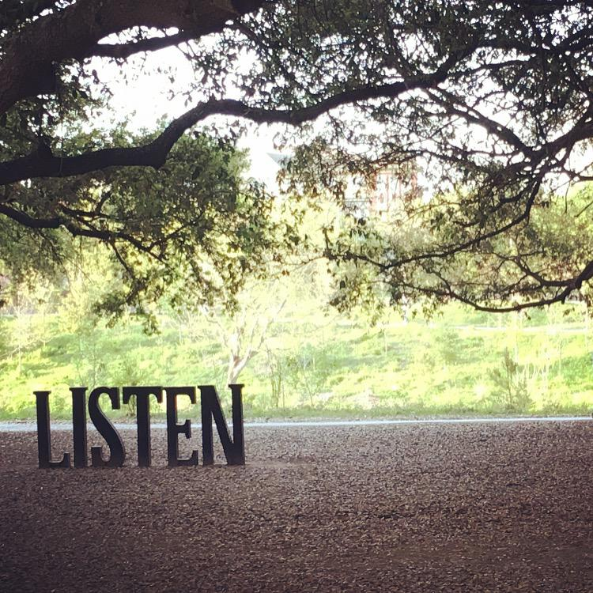

# Listen Carefully

Please :star: this repo as there's much more content under development.  

Poems composed by a human intelligence, i.e., yours truly.

Prompt engineering for creating images also by yours truly.
  
Images by generative AI, currently DALL-E via Bing, unless otherwise noted.

Enjoy these poems. 

- [Green Card Dreams](https://github.com/mynampaty/listening-to-lines/tree/main/poems/Green-Card-Dreams.md)
- [Hell](https://github.com/mynampaty/listening-to-lines/tree/main/poems/Hell.md)
- [Ode to my EV](https://github.com/mynampaty/listening-to-lines/tree/main/poems/Ode-to-my-EV.md)
- [Sheep vs. Solzhenitsyn](https://github.com/mynampaty/listening-to-lines/blob/main/poems/Lies.md)  
- [WW4](https://github.com/mynampaty/listening-to-lines/blob/main/poems/WW4.md)  

_Photo by Ravi Mynampaty. Location: Buffalo Bayou Park, Houston TX_  
  
