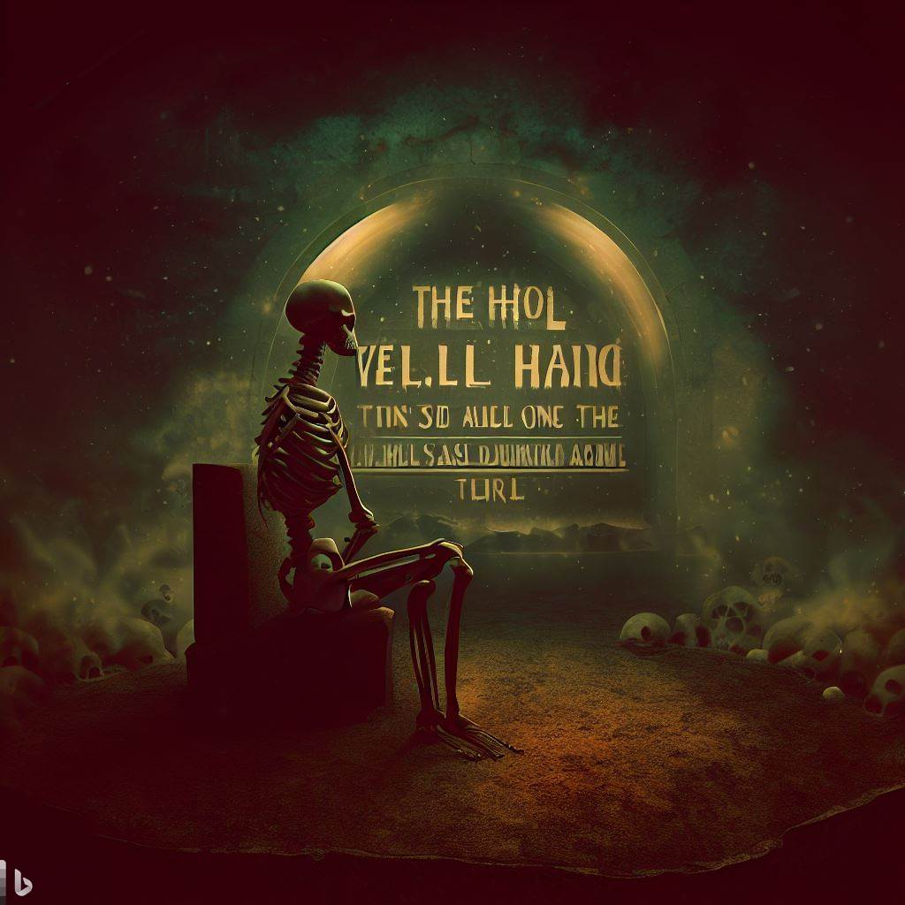

# Hell

What is hell? It’s been said:  
hell is a waiting room,  
for all souls beyond the tomb.  

What is hell? It’s been said:  
hell is a gap in the heart,  
where God plays no part.   

What is hell? It’s been said:  
hell is nothingness,  
death leaves zero to bless.   

What is hell? It’s been said:  
hell is a blaze, a scorcher,  
consuming sinners, a torture.   

What is hell? It’s been said:  
hell is a fleeting pass-through,  
after eons, life begins anew.   

What is hell? It’s been said:  
hell is a place for penance,  
the fruit of _karma_, in essence.  

What is Hel? It’s been said:  
Hel is a ride away on bus 666,  
among resorts, one of the top picks.  

What is hell? It’s been said:  
hell is other people in the room,   
sharing the no-exit sense of gloom.  

What is hell? It’s been said:  
Hell is the person you are, comfortable in your skin,  
one day meeting the person you could have been.  

_-Ravi Mynampaty_  
_February 2023_

