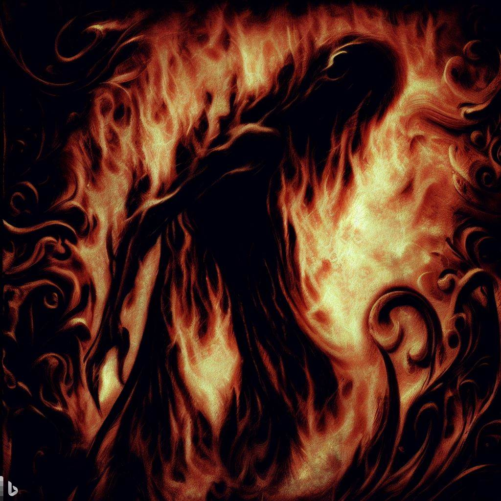

# I’m on Fire  
_Translated from Zakir Khan’s original Urdu_  

The smoldering remains of your betrayal   
&nbsp;&nbsp;&nbsp;&nbsp;embrace this spirit of mine.  
My soul would no longer be on fire   
&nbsp;&nbsp;&nbsp;&nbsp;if only you were to become mine.  

_by Ravi Mynampaty_  
July 2023  

