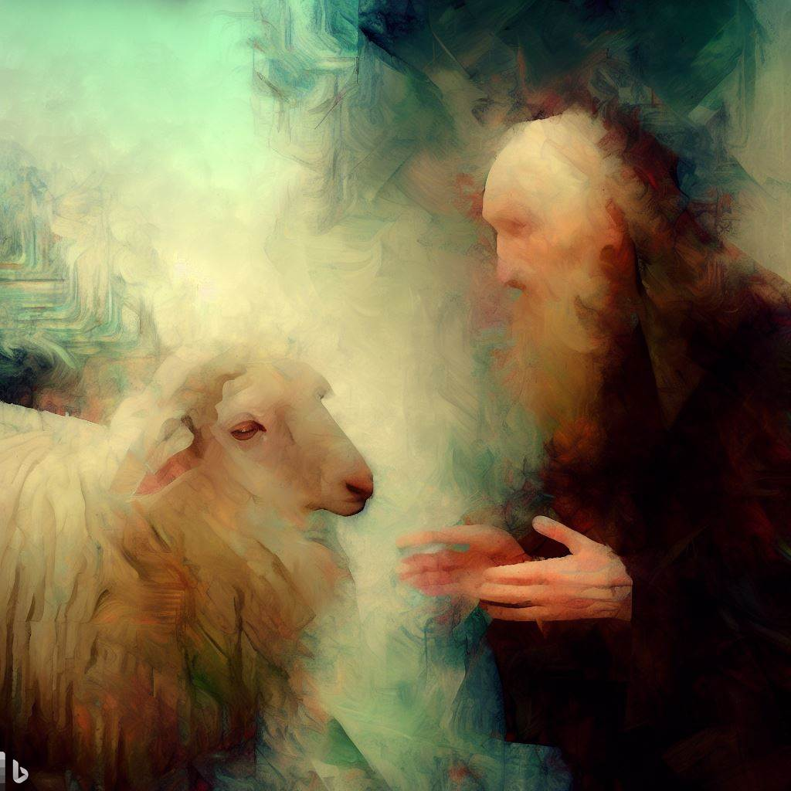

# Sheep vs. Solzhenitsyn  
_A simultaneous experiment in acrostic, exquisite corpse, and flyting forms, with kennings._  

Sh:  
&nbsp;&nbsp;&nbsp;&nbsp;&nbsp;&nbsp;&nbsp;&nbsp;Lie-laden opinions constitute harmless indulgences.    
&nbsp;&nbsp;&nbsp;&nbsp;&nbsp;&nbsp;&nbsp;&nbsp;Inscrutable speech shields vulnerable pencil-pushers.   
&nbsp;&nbsp;&nbsp;&nbsp;&nbsp;&nbsp;&nbsp;&nbsp;Vanilla words construct least-resistance paths.  
&nbsp;&nbsp;&nbsp;&nbsp;&nbsp;&nbsp;&nbsp;&nbsp;Evasive language immunizes gun-shy herds.  

**Sol:**   
&nbsp;&nbsp;&nbsp;&nbsp;&nbsp;&nbsp;&nbsp;&nbsp;**Noble speech contains no distortions.**  
&nbsp;&nbsp;&nbsp;&nbsp;&nbsp;&nbsp;&nbsp;&nbsp;**Omnipotent word-_hords_ hold zero falsehoods.**     
&nbsp;&nbsp;&nbsp;&nbsp;&nbsp;&nbsp;&nbsp;&nbsp;**True voices eschew warped language.**  

Sh:  
&nbsp;&nbsp;&nbsp;&nbsp;&nbsp;&nbsp;&nbsp;&nbsp;Bone-headed boldness destroys secure careers.  
&nbsp;&nbsp;&nbsp;&nbsp;&nbsp;&nbsp;&nbsp;&nbsp;Youth-like candor rocks steady boats.  

**Sol:**      
&nbsp;&nbsp;&nbsp;&nbsp;&nbsp;&nbsp;&nbsp;&nbsp;**Lily-livered speech spawns vile results.**    
&nbsp;&nbsp;&nbsp;&nbsp;&nbsp;&nbsp;&nbsp;&nbsp;**Individual courage demolishes doublespeak card-houses.**    
&nbsp;&nbsp;&nbsp;&nbsp;&nbsp;&nbsp;&nbsp;&nbsp;**Earnest honesty lights hopeful sparks.**    
&nbsp;&nbsp;&nbsp;&nbsp;&nbsp;&nbsp;&nbsp;&nbsp;**Simple action: Reject “harmless” untruths.**  

_March 2023_  

