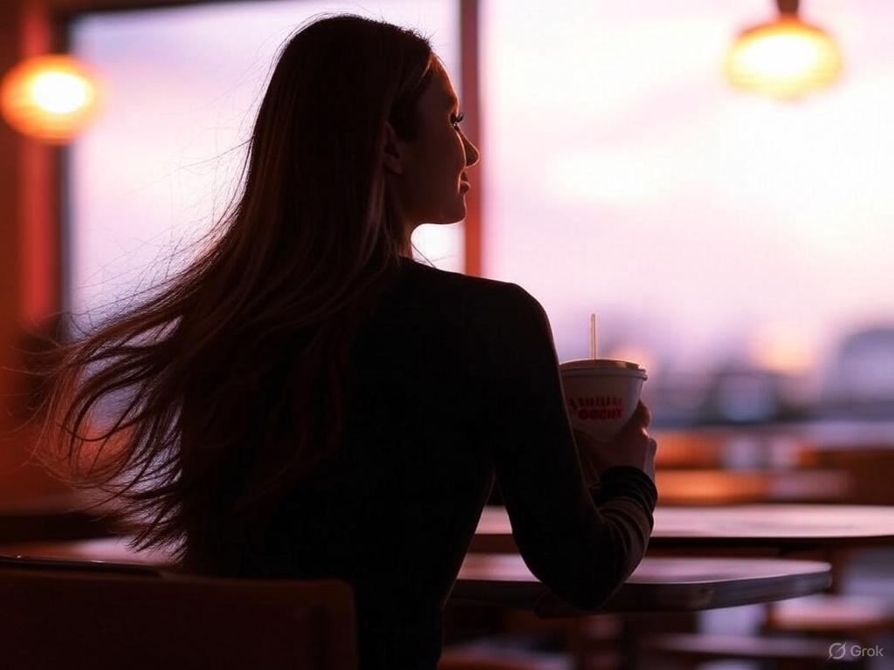

# A Love Letter to a Long-haired Dunkin Donuts Supermodel
_Loosely translated from Indeevar’s original Hindi_  

That day when he breaks your heart,  
And you feel the world coming apart,  

Come to me then, my love,  
My heart is open and true,  
It remains forever ajar for you.  

Love is to be unconditional,  
But yours was transactional.  
We went out once when it was sunny,  
And you asked to split gas money.  

When your esteem goes into free fall,  
Enveloped in life’s autumnal pall,  

Come to me then, my love,  
My head bows, in public view,  
It is forever bowed to you.  

You have little use for me right now,  
Having your pick of lovers, from stern to prow.  
You are Flora reincarnate, in high demand,  
Forests of flowers blossom at your command.  

When the looking glass begins to startle  
you, as strands of youth come to unravel,  

Come to me then, my love,  
Sparks of my love will blaze anew,  
They will blaze forever for you.  

_by Ravi Mynampaty_  

  
