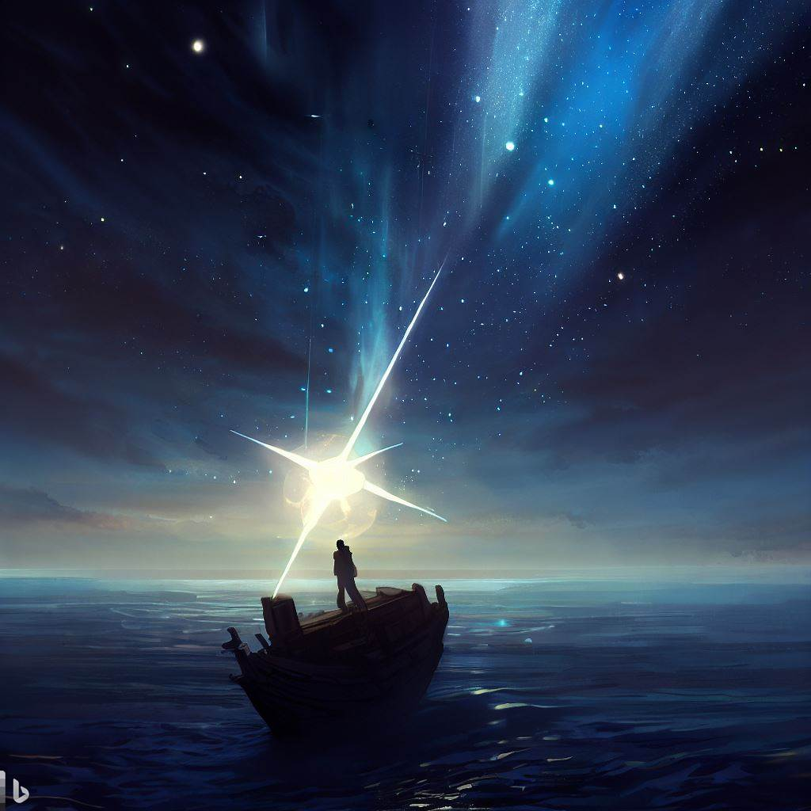

# Memory  
_After Nye’s “Famous”_  

Starlight is a memory of the navigator.  

The sun is a memory of darkness,  
which knows it rules the universe even if, my God,  
it is full of stars.  

The exam is a memory of the student, haunting  
dreams into old age.  

The soap bubble, fleeting, is a memory of the child.  

The slighted, unanswered first love   
is a memory of the heart.  

The native plant is a memory of Mother Nature,  
more of a memory than a manicured lawn,  
which is a memory of only the suburbs.  

The dog-eared scripture is a memory of one who prays  
and not at all a memory of the one who is praised.  

I want to be a memory of young adults,  
two young, too young for the real world,  
as they scramble to find their footing,  
a memory as one who lived not by lies.  

I want to be a memory in a way a bike ride is a memory  
of muscles, not because riding once seemed impossible  
but, because, since the start, dad was always on their side.  

_by Ravi Mynampaty_  
November 2022

