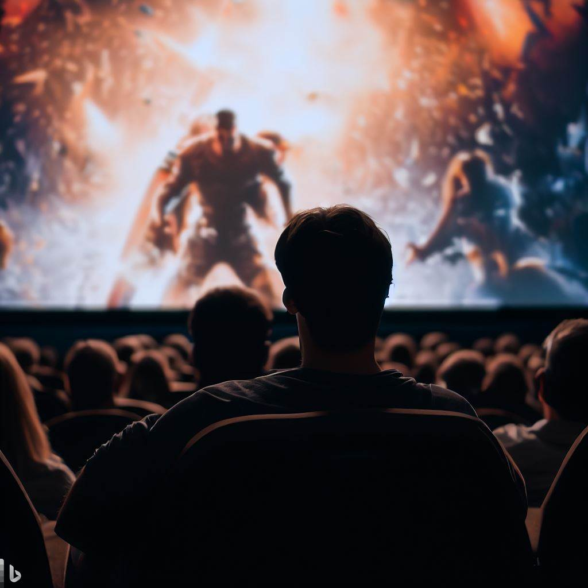

# A Jaded Critic Goes to the Movies  

_After Swenson's "The James Bond Movie"_  

I watch the best Hollywood movie not   
made in Hollywood. The two leads are  

spectacular, they are beautiful Gladiators.  
Two hyper-masculine men, like Greek gods  

but from India. Super-Indians, sensitive, thoughtful,   
who rescue kids, toss motorcycles, and beat up   

Englishmen. It’s a tip of the hat to old Hollywood   
which could not make a movie like this today.  

Big studios suck, franchises are run by morons   
who artificially and pointlessly infuse sanctimony   

constantly insulting their audiences  
who are tired of being lectured to.  

I suspend my disbelief and strap myself in  
for a circus. This scratches an itch for me.  

Here I witness a pure friendship, a brotherhood,   
a 3-hour extravaganza. Action. Fantasy. Love story.  

The song-and-dance is a non-violent fight scene,  
lyrics and prose flow together seamlessly.  

The story is a _sutra_ which transcends genre, binds   
the audience to this epic yarn. Enthralling. Enchanting.  

The characters are Shakespearan. I scream   
with joy. I am entertained. This is why I’m here.  

_by Ravi Mynampaty_  
March 2023

