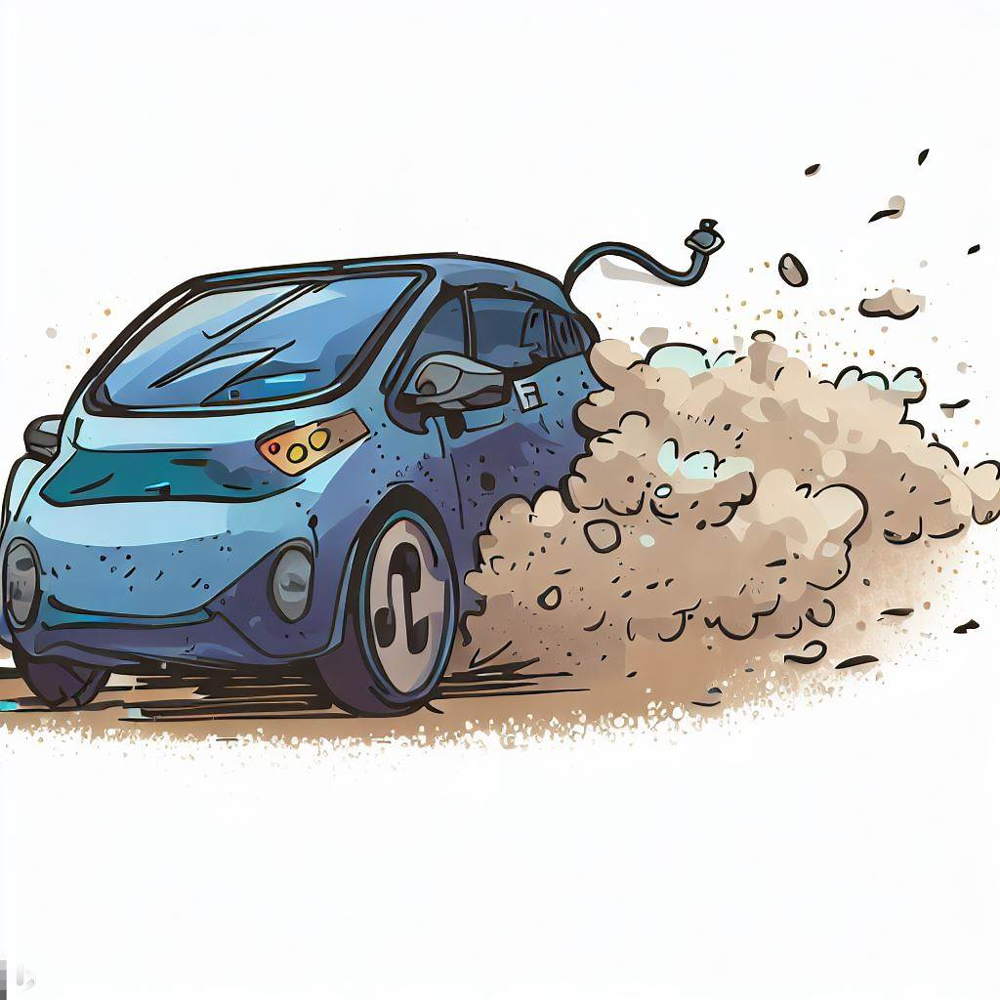

# Ode to my EV  

I was shopping  
for a new ride,  
the day after   
my beemer died.  

I sought another  
six-speed stick, but  
a friend lit a spark so  
I tried something new.  

Zero trips to Jiffy Lube,  
zero emissions, near-  
zero fuel cost. Beats a Camaro  
zero-to-sixty. (This was a lie!)  

Aggressive regen,  
battery revived,  
like a go-kart ride,  
with one-pedal drive.  

Fast as a thunder  
Bolt, instant torque.  
When lights turn green  
first off the blocks.  

Engineered just fine, but  
marketing is strange,  
mailing me coupons  
for fluids and an oil change.  

As I await the Cybertruck  
with its launch dates fickle,  
I have her sleeping   
next to my bicycle.  

_by Ravi Mynampaty_  
February 2023

