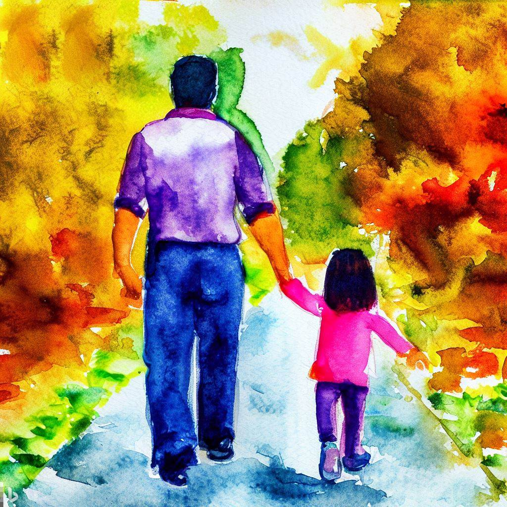

### A Random Walk with a Girl Who Has the Same Name as My Mom  

You held my finger tight  
as you learned to walk.  
Stumbling, saying: “I’m fine!”    
with no trace of despair.   
Eyes brimming with life  
hinted: “You can keep up, I hope.”  

It has always been my hope  
you’ll understand why I’m so tight-  
fisted in many aspects of life.  
I believe if you choose to walk  
or buy a cheap car you will not despair.  
In hard times, you’ll likely be just fine.  

The car too will be fine,  
suffering no damage, hope-  
fully, if you heed my despair-  
ing pleas to close its sunroof tight  
in rainstorms, as you go on walk-  
abouts, pondering mysteries of life.  

As you begin navigating your own life  
crafting your songs, strumming, humming, fine-  
tuning your voice, only sometimes walk-  
ing before running, with my heart and mind I hope  
that with both hands you hold on real tight  
to your fam and your dreams, never having to despair.  

Sometimes success soon follows despair.  
Such occasions are rare in life.  
Bottle that feeling and seal it up tight  
so you can take a peek when you don’t feel fine.  
This can rekindle and reignite hope.  
It’s like clearing your head by taking a walk.  

Counsel you received since you walk-  
ed on tiptoe, was that despair  
is transient, as is the case with hope.  
Harmonize them for an optimal life  
and create a melody that’s so fine  
it braids the two together extra tight.  

Life, you see, is a fine balance.  
It’s like walk-ing a tight-rope,    
between despair and hope.    

_by Ravi Mynampaty_  
April 2023  

