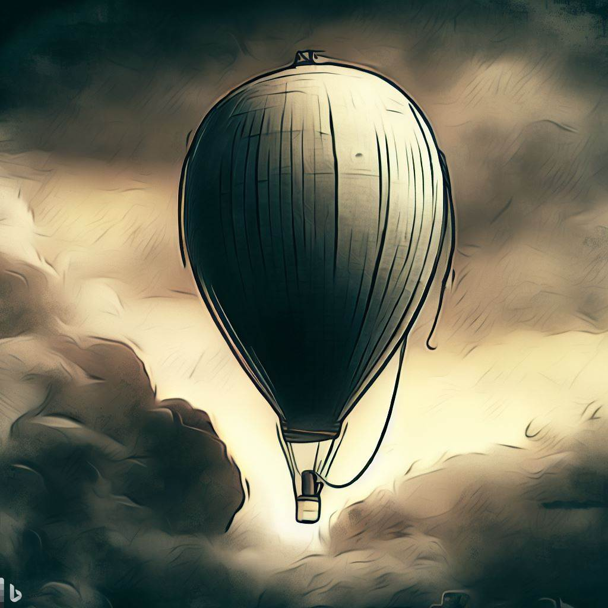

# Toy

There is one toy every child  
loves to possess, a gravity-   
defying delight.  

It’s not a plane, it’s not a bird,  
It’s surely not an alien  
from Krypton.  

The toy that’s fun and festive,  
Its surface smooth and shiny,  
Uplifting the mood.   

The toy that creates more smiles  
when in bunches, multi-colored,  
sometimes twisted.  

The toy that is a parent’s despair,  
as it floats away, lazily deflates,   
or pops, suddenly.   

But I am no plaything for  
a child. I won’t be controlled,  
I’m without strings.  

I observe the weather, sometimes  
I take a wrong turn, over  
the Aleutian Islands.  

I’m like Santa at Christmas, tracked  
by NORAD. U-2 saw me, I smiled   
wide for the camera.  

I took a tour over the Mountain West,   
the silos are lovely I hear,  
this time of the year.  

Now my secret’s out, I’m but a part  
of a global fleet, constructed   
for circumnavigation.  

I was an eye in the sky  
looking at U.S.  
Now I don’t see any more.  

_by Ravi Mynampaty_  
February 2023  

