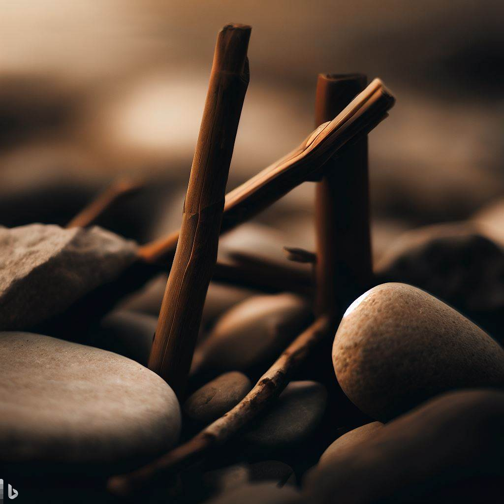

# WW4

Now we fight with sticks-n-stones,   
We are just playing,  
Now we break legs-n-bones,  
We are not slaying.  

There were many close calls,  
Near misses, how exciting!   
Possible fumbles of footballs?  
Kept us busy, nail-biting.  

Cruise missile made a right turn,  
It was a misfire, what a relief!  
Merely tracked, retaliation spurned,  
No one was hurt, it beggars belief.   

Once a man used his veto,  
He was aptly named Stanislav,  
We didn’t deserve this hero,  
But he’s one we’re glad to have.  

Arrows, we had quite a few,  
(Almost three dozen,  
Upon further review.)  
Hey! they were all broken.  

Let’s take some credit,  
We did learn a lesson,  
Shook hands in a summit,  
When peace was in season.   

In a blue sky and yellow field,  
A rocket army was put to pasture,  
Deep silos with concrete filled,  
A museum, with Satan as a feature.  

What finally pushed us over?  
Maybe it was Little Rocket Man.  
Was he “protecting” his border  
By attacking the Sea of Japan?  

Was it a minor border skirmish  
 In the old Raj, which made  
A General decide to finish,   
His decades-long crusade?  

Maybe it was wannabe-Peter-  
The great, who pushed the button,  
Because he found defeat a bitter  
Pill, and took a step so wanton.   

Foretelling this fate, we said  
Let’s “Occupy Mars!”  
Alas, in that lifetime,  
It did not come to pass.  

_by Ravi Mynampaty_  
September 2022

